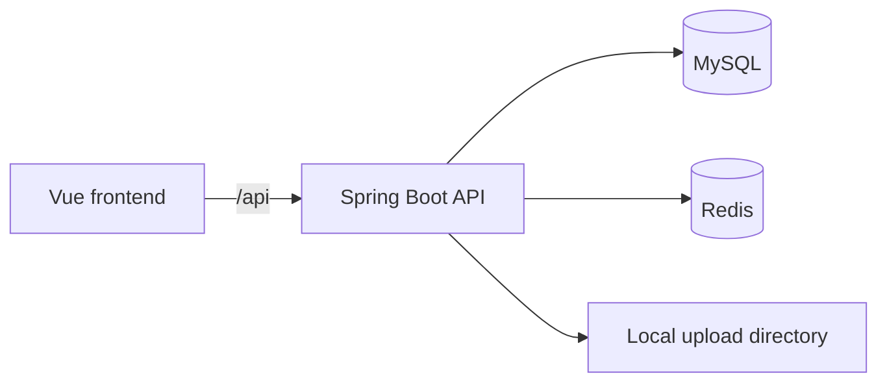

# FlowerKissTao

FlowerKissTao is a full-stack application for people growing plants at home. It connects plant discovery, environment-aware recommendations, shopping with simulated payments, and care after confirming delivery. Operators can manage catalog data, knowledge articles, orders, users, and operational data through the admin console.

[中文文档](./README.zh-CN.md) · [Project home](./README.md)

[Quick start](#quick-start) · [Configuration](#configuration) · [API overview](#api-overview)

## What it supports

- Browse plant catalogs, detail pages, and filters.
- Filter plants by safety and environmental rules, then rank candidates using light, temperature, humidity, care capacity, space, budget, and preference scores.
- Register and sign in, then manage scene profiles, cart items, addresses, orders, and personal details.
- Use `/profile` to change a username or nickname, verify the current password before changing it, and upload a JPG, PNG, or GIF avatar up to 2 MB.
- Create a care archive and tasks after confirming delivery. Complete, skip, or postpone tasks, receive reminders, request health reviews, and add growth notes.
- Read care articles, save favorites, and submit usefulness feedback.
- Use the operations console to manage species, SKUs, knowledge articles, orders, user roles, and operation data.

## Runtime relationship



The frontend development server proxies `/api` and `/uploads` to the backend. MySQL stores business data, while Redis provides caching, rate limiting, and distributed locks. Avatars are validated, resized to a maximum edge of 512 pixels, re-encoded as PNG, and stored in `avatars/` under `APP_UPLOAD_DIR`. Images in growth notes use a separate Base64 storage format.

## Tech stack

| Area | Technology | Version or detail |
| --- | --- | --- |
| Backend | Java | 17 compilation target |
| Web and security | Spring Boot, Spring Security | Spring Boot 3.5.16; security dependency versions are managed by Boot |
| Data access | MyBatis-Plus | 3.5.15 |
| Database | MySQL | Default database: `plant` |
| Cache and rate limiting | Redis | Default port: `6386` |
| Frontend | Vue, Vue Router, Pinia, Element Plus | Vue 3.5.40 |
| Build | Vite | 8.1.5 |
| Package manager | pnpm | 11.9.0 |

## Prerequisites

- JDK 17 or later.
- Maven.
- Node.js `^22.18.0` or `>=24.12.0`.
- pnpm 11.9.0.
- MySQL and Redis.

The default configuration connects to MySQL at `127.0.0.1:3306` with database `plant`, and Redis at `127.0.0.1:6386`. Start both services and set connection credentials using the configuration table below. Set `SPRING_DATASOURCE_URL` to use another MySQL host or database.

## Quick start

### 1. Initialize the database

Use these steps for a new database. Open a terminal at the repository root, connect with the MySQL client, and enter your database password when prompted:

```powershell
mysql --host=127.0.0.1 --port=3306 --user=root --password --default-character-set=utf8mb4
```

Then run the following in the MySQL client:

```sql
CREATE DATABASE plant CHARACTER SET utf8mb4;
USE plant;
SOURCE src/main/resources/db/schema.sql;
SOURCE src/main/resources/db/data.sql;
EXIT;
```

The schema script rebuilds tables. Do not rerun it against a database containing business data. The repository currently has schema and seed scripts but no separate incremental migration directory; back up and compare the schema before upgrading an existing database. Backend connection defaults are in [`application.yml`](./src/main/resources/application.yml).

### 2. Run the backend

From the repository root:

```powershell
mvn spring-boot:run
```

The backend listens on `http://127.0.0.1:8099` by default.

### 3. Run the frontend

In a second terminal:

```powershell
cd frontend
pnpm install
pnpm dev
```

The frontend listens on [http://127.0.0.1:5173](http://127.0.0.1:5173) by default. Browse `/plants`, register through `/login`, then fill in an environment profile at `/recommendation` to generate recommendations. Click the avatar in the header to edit personal details at `/profile`.

## Development commands

Run backend commands from the repository root. The suite includes MySQL integration tests, so a database must be available. Test profile changes are rolled back after each test.

```powershell
mvn test
mvn package
```

Frontend:

```powershell
cd frontend
pnpm type-check
pnpm build
```

Optional database checks require Python 3 and the MySQL client on PATH. The schema check reads the target database without changing it:

```powershell
python scripts/verify_schema.py
```

Check clean database initialization and the Spring application context:

```powershell
python scripts/verify_clean_init.py
```

This script creates and removes the dedicated temporary database `plant_verify_flowerkisstao`; it does not initialize the application database. Its Spring check connects to `127.0.0.1:3306` and invokes Maven offline, so download Maven dependencies first. Set `MAVEN_CMD` to select a Maven executable. Both scripts read connection settings from `MYSQL_HOST`, `MYSQL_PORT`, `MYSQL_USERNAME`, and `MYSQL_PASSWORD`.

## Configuration

Backend configuration is defined in [`application.yml`](./src/main/resources/application.yml). Common environment variables:

| Variable | Default | Purpose |
| --- | --- | --- |
| `SPRING_DATASOURCE_URL` | Local `plant` connection from configuration | Override the MySQL JDBC URL |
| `MYSQL_USERNAME` | `root` | MySQL username |
| `MYSQL_PASSWORD` | Local development default | MySQL password |
| `REDIS_HOST` | `127.0.0.1` | Redis host |
| `REDIS_PORT` | `6386` | Redis port |
| `REDIS_PASSWORD` | Local development default | Redis password |
| `REDIS_ENABLED` | `true` | Enable Redis |
| `JWT_SECRET` | Local development default | JWT signing secret |
| `JWT_EXPIRE_MINUTES` | `120` | JWT lifetime in minutes |
| `APP_UPLOAD_DIR` | `uploads` | Avatar storage root; relative paths resolve from the backend working directory |

Frontend settings are listed in [`frontend/.env.example`](./frontend/.env.example):

| Variable | Purpose |
| --- | --- |
| `VITE_PUBLIC_BASE` | Static asset base path |
| `VITE_API_BASE_URL` | API prefix |
| `VITE_API_PROXY_TARGET` | Vite development proxy target |

Inject passwords, JWT secrets, and Redis credentials through environment variables or private configuration in production. Do not commit real credentials. Point `APP_UPLOAD_DIR` to persistent storage when deploying avatar uploads.

## API overview

Backend APIs use the `/api` prefix. Links below lead to the controller sources; the corresponding DTOs define exact fields and validation.

| Module | Path prefix | Capability |
| --- | --- | --- |
| [Authentication](./src/main/java/com/zyt/flowerkisstao/user/web/controller/AuthController.java) | `/api/auth` | Registration, login, current user, and logout |
| [Personal profile](./src/main/java/com/zyt/flowerkisstao/user/web/controller/UserProfileController.java) | `/api/user/profile` | Read profile, update username/nickname/password, upload avatar |
| [Scene profiles](./src/main/java/com/zyt/flowerkisstao/user/web/controller/SceneProfileController.java) | `/api/profiles` | Create, edit, delete, and set the default profile |
| [Plant catalog](./src/main/java/com/zyt/flowerkisstao/catalog/web/controller/PlantController.java) | `/api/catalog` | Plant queries, details, and filters |
| [Recommendations](./src/main/java/com/zyt/flowerkisstao/recommendation/web/controller/RecommendationController.java) | `/api/recommendations` | Generate, read, and record recommendation clicks |
| Commerce | `/api/cart`, `/api/orders`, `/api/addresses` | Cart, orders, and addresses |
| [Care](./src/main/java/com/zyt/flowerkisstao/care/web/controller/CareArchiveController.java) | `/api/care` | Plant archives, tasks, reviews, notes, and notifications |
| [Knowledge](./src/main/java/com/zyt/flowerkisstao/knowledge/web/controller/KnowledgeController.java) | `/api/knowledge` | Articles, recommendations, favorites, and feedback |
| Operations | `/api/admin/**` | Catalog, knowledge, orders, users, roles, and operation data |

## Project structure

```text
.
├── pom.xml                         # Spring Boot backend build configuration
├── src/main/java/...               # Backend modules, services, and APIs
├── src/main/resources/             # Backend configuration and database resources
├── src/test/java/...               # Backend unit and integration tests
├── frontend/src/                   # Vue pages, modules, and shared components
├── frontend/.env.example           # Frontend environment template
└── scripts/                        # Database initialization and schema checks
```

## License

This project is licensed under the [MIT License](./LICENSE).
