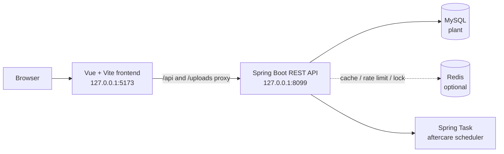

# FlowerKissTao · 花吻陶

[中文 README](README.md) · [MIT License](LICENSE)

FlowerKissTao is a full-stack plant service built around one idea: understand a room before choosing a plant. A user records light, space, pet safety, and available care time; the service filters and ranks suitable plants, then carries the journey through discovery, purchase, and aftercare.


## ✨ What it provides

- **Environment-aware recommendations**: hard filters and weighted ranking across light, temperature, humidity, space, budget, preference, and care effort, with an explanation for each result.
- **Plant catalog**: browse species and SKUs with sizes, stock, and care attributes.
- **Aftercare plans**: create a plant archive after delivery, schedule tasks and reminders, record health notes, and request a re-evaluation.
- **Knowledge base**: read care articles publicly; signed-in users can save articles and submit usefulness feedback.
- **Commerce flow**: manage addresses and cart items, create orders, simulate payment, ship, receive, and process after-sale states.
- **Operations console**: role-protected screens for catalog, SKU inventory, orders, articles, recommendation weights, users, and operation logs.

## Runtime shape



## 🚀 Quick start

### 1. Prerequisites

- Java 17 or newer (the Maven release target is 17)
- Maven
- Node.js `^22.18.0` or `>=24.12.0`
- pnpm `11.9.0`
- MySQL with a database named `plant`
- Redis at `127.0.0.1:6386` by default. If Redis is not available, set `REDIS_ENABLED=false` before starting the backend.

### 2. Initialize MySQL

Run these commands from the repository root, replacing the credentials with your local setup:

```powershell
mysql -u root -p -e "CREATE DATABASE IF NOT EXISTS plant CHARACTER SET utf8mb4 COLLATE utf8mb4_unicode_ci"
Get-Content .\src\main\resources\db\schema.sql | mysql -u root -p plant
Get-Content .\src\main\resources\db\data.sql   | mysql -u root -p plant
```

`schema.sql` creates the tables; `data.sql` loads roles, permissions, plants, SKUs, and knowledge articles. Together they create 24 business tables and seed `admin`, `operator`, and `demo` accounts for local RBAC demonstrations. Change passwords and the JWT secret before any real deployment.

### 3. Start the backend

```powershell
mvn spring-boot:run
```

The API listens on `http://127.0.0.1:8099`. Override the `REDIS_*` and `JWT_*` environment variables when your services use different settings. MySQL credentials use `MYSQL_USERNAME` and `MYSQL_PASSWORD`.

### 4. Start the frontend

In another terminal:

```powershell
cd frontend
pnpm install --frozen-lockfile
pnpm dev
```

Open <http://127.0.0.1:5173>. Vite proxies `/api` and `/uploads` to `VITE_API_PROXY_TARGET` (default `http://localhost:8099`). Copy `frontend/.env.example` to a local environment file when you need to change the public base path or proxy target.

## 🧪 Checks and tests

```powershell
# Backend unit tests and Spring context tests
mvn test

# Frontend type checking and production build
cd frontend
pnpm type-check
pnpm build
```

Return to the repository root before running the backend scripts:

```powershell
cd ..
```

For the end-to-end smoke flow, start the backend and initialize the database first:

```powershell
python scripts/smoke_demo.py
```

The script registers a temporary user and checks recommendation, cart, checkout, idempotent payment, admin shipping, receipt confirmation, and aftercare maintenance. It removes the temporary data by default. Database-focused checks:

```powershell
python scripts/verify_clean_init.py   # initialize an isolated DB and start Spring context
python scripts/verify_schema.py       # compare schema.sql with a live database
```

## 🔌 API areas

Controllers are grouped by domain under `/api`:

| Area | Paths | Purpose |
| --- | --- | --- |
| Auth | `/api/auth` | Register, login, current user, logout |
| Catalog | `/api/catalog` | Plant lists, details, and facets (public GET) |
| Recommendation | `/api/profiles`, `/api/recommendations` | Scene profiles and recommendation results |
| Care | `/api/care` | Archives, tasks, reminders, health reports, maintenance runs |
| Knowledge | `/api/knowledge` | Articles, facets, recommendations, and favorites |
| Commerce | `/api/cart`, `/api/orders`, `/api/addresses` | Cart, orders, and addresses |
| Admin | `/api/admin/**` | Catalog, orders, content, rules, users, and operations |

Use the controller definitions under `src/main/java/**/web/controller` as the authoritative route reference.

## Key configuration

| Variable | Default | Purpose |
| --- | --- | --- |
| `MYSQL_USERNAME` / `MYSQL_PASSWORD` | `root` / local default | MySQL credentials |
| `REDIS_HOST` / `REDIS_PORT` | `127.0.0.1` / `6386` | Redis endpoint |
| `REDIS_ENABLED` | `true` | Global cache, rate-limit, and lock switch |
| `APP_UPLOAD_DIR` | `uploads` | Directory for uploaded avatars and files |
| `JWT_SECRET` / `JWT_EXPIRE_MINUTES` | local development default / `120` | JWT signing key and lifetime in minutes |
| `VITE_API_PROXY_TARGET` | `http://localhost:8099` | Frontend dev-server proxy target |

Inject database, Redis, and JWT secrets through a secure environment or secret manager in production.

## Repository map

```text
src/main/java/com/zyt/flowerkisstao/
├── catalog/          # Plant species and SKUs
├── recommendation/   # Recommendation model, weights, and results
├── care/             # Archives, tasks, and reminders
├── knowledge/        # Care articles
├── trade/            # Cart, addresses, and orders
├── user/             # Auth, profiles, and RBAC
├── operation/        # Dashboard, visits, and operation logs
└── shared/           # Security, cache, and shared configuration
frontend/src/modules/ # Vue pages, stores, and APIs by domain
src/main/resources/db # schema.sql and data.sql
scripts/              # Smoke, initialization, and schema checks
```

## Contributing

Run the type check, build, or tests for the area you changed. When adding a database field, update `schema.sql`, the entity, and its mapper together, then run `verify_schema.py` to check for drift.

## License

Released under the [MIT License](LICENSE).


