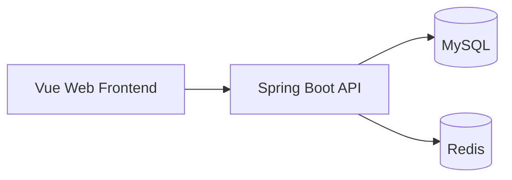

# FlowerKissTao

FlowerKissTao is a full-stack plant service application for household plant users. It covers plant discovery, environment-aware recommendations, shopping workflows, and care plans and growth records after delivery. Operators can manage catalog data, knowledge content, orders, users, and operation data through the admin console.

[中文文档](./README.zh-CN.md)

## Features

- Browse plant catalogs, detail pages, and available filters.
- Generate plant recommendations from light, temperature, humidity, space, budget, and preference data, with configurable recommendation weights.
- Support registration, login, JWT authentication, scene profiles, cart, addresses, and order state transitions.
- Create a care archive after delivery, schedule care tasks, and record completion, skips, postponements, health reviews, and growth notes.
- Provide care knowledge articles, recommendations, favorites, and usefulness feedback.
- Provide a role- and permission-based operations console for catalog, knowledge, orders, users, roles, and operation data.

## Architecture Overview



The frontend accesses backend APIs through `/api`. The backend stores business data in MySQL and uses Redis for caching, rate limiting, and distributed locks. Backend API controllers are under `src/main/java/com/zyt/flowerkisstao/**/web/controller`.

## Project Structure

```text
.
├── pom.xml                         # Spring Boot backend build configuration
├── src/main/java/...               # Backend modules and APIs
├── src/main/resources/             # Backend config, MySQL schema, and seed data
├── src/test/java/...               # Backend tests
├── frontend/package.json           # Frontend scripts and dependencies
├── frontend/src/                   # Vue pages, modules, and shared components
├── frontend/.env.example           # Frontend environment template
└── scripts/                        # Database verification scripts
```

## Tech Stack

| Category | Technology | Version | Purpose |
| --- | --- | --- | --- |
| Backend runtime | Java | 17 | Compilation target |
| Backend framework | Spring Boot | 3.5.16 | Web, security, validation, and scheduling |
| Data access | MyBatis-Plus | 3.5.15 | MySQL access and pagination |
| Database | MySQL | — | Business data storage |
| Cache and rate limiting | Redis | — | Caching, rate limiting, and distributed locks |
| Frontend framework | Vue | 3.5.40 | Customer and operations interfaces |
| Frontend build | Vite | 8.1.5 | Development server and production builds |
| Frontend package manager | pnpm | 11.9.0 | Frontend dependency management |

## Prerequisites

- JDK 17 or later.
- Maven.
- Node.js `^22.18.0` or `>=24.12.0`.
- pnpm `11.9.0`.
- MySQL and Redis.

The default configuration connects to MySQL at `127.0.0.1:3306` with database `plant`, and Redis at `127.0.0.1:6386`.

## Quick Start

### Initialize the database

Run [`schema.sql`](./src/main/resources/db/schema.sql) followed by [`data.sql`](./src/main/resources/db/data.sql) to create the `plant` schema and seed data. Backend connection defaults are defined in [`application.yml`](./src/main/resources/application.yml).

Verify clean database initialization:

```powershell
python scripts/verify_clean_init.py
```

The script uses the temporary database `plant_verify_flowerkisstao` and drops it when finished.

### Run the backend

```powershell
mvn spring-boot:run
```

The backend listens on `http://127.0.0.1:8099` by default.

Backend tests and packaging:

```powershell
mvn test
mvn package
```

### Run the frontend

```powershell
cd frontend
pnpm install
pnpm dev
```

The frontend development server listens on `http://127.0.0.1:5173` by default and proxies `/api` to `http://127.0.0.1:8099`.

Frontend type checking and production build:

```powershell
pnpm type-check
pnpm build
```

## Configuration Reference

Backend configuration is defined in [`application.yml`](./src/main/resources/application.yml). Common environment variables:

| Variable | Default | Purpose |
| --- | --- | --- |
| `MYSQL_USERNAME` | `root` | MySQL username |
| `MYSQL_PASSWORD` | `123456` | MySQL password |
| `REDIS_HOST` | `127.0.0.1` | Redis host |
| `REDIS_PORT` | `6386` | Redis port |
| `REDIS_PASSWORD` | `123456` | Redis password |
| `REDIS_ENABLED` | `true` | Enable Redis capabilities |
| `JWT_SECRET` | Local development default | JWT signing secret |
| `JWT_EXPIRE_MINUTES` | `120` | JWT lifetime in minutes |

Frontend settings are listed in [`frontend/.env.example`](./frontend/.env.example):

| Variable | Purpose |
| --- | --- |
| `VITE_PUBLIC_BASE` | Static asset base path |
| `VITE_API_BASE_URL` | API prefix |
| `VITE_API_PROXY_TARGET` | Vite development proxy target |

Inject passwords, JWT secrets, and Redis credentials through environment variables in production. Do not commit real credentials.

## API Overview

Backend APIs use the `/api` prefix. Main modules:

| Module | Path prefix | Capability |
| --- | --- | --- |
| Authentication | `/api/auth` | Registration, login, current user, and logout |
| Plant catalog | `/api/catalog` | Plant queries and filters |
| Recommendations | `/api/recommendations` | Generate, view, and provide feedback on recommendations |
| Commerce | `/api/cart`, `/api/orders`, `/api/addresses` | Cart, orders, and addresses |
| Care | `/api/care` | Care archives, tasks, reviews, notes, and notifications |
| Knowledge | `/api/knowledge` | Articles, recommendations, favorites, and feedback |
| Operations | `/api/admin/**` | Catalog, knowledge, orders, users, roles, and operation data |

## Development Verification

Backend tests:

```powershell
mvn test
```

The schema comparison script reads the target database without modifying it:

```powershell
python scripts/verify_schema.py
```

## Security And Privacy

The application handles user accounts, addresses, orders, and care records. The default configuration is for local development; inject production passwords, JWT secrets, and Redis credentials through environment variables or private configuration. Use de-identified data for demos, tests, and screenshots.

## License

This project is licensed under the [MIT License](./LICENSE).

