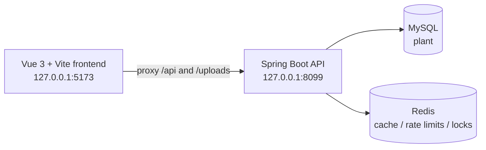

# FlowerKissTao

FlowerKissTao is a full-stack indoor-plant shopping and care application. Users can browse plants, describe their space and care habits, receive environment-aware recommendations, place orders, and continue with personalized care plans and reminders after delivery. Operators and administrators use a separate back office to manage products, inventory, orders, knowledge articles, recommendation rules, and account permissions.

[中文 README](README.md)


## What it includes

- Plant catalog, species, SKU, and inventory management
- Recommendations based on light, temperature, humidity, space, budget, pets, and care habits
- Registration, login, JWT sessions, roles, and permission checks
- Cart, addresses, order creation, simulated payment, shipping, receiving, and after-sales flows
- Post-purchase plant archives, care tasks, health reports, notes, and in-app notifications
- A public plant-care knowledge base and an article publishing workflow for operators
- Operations dashboard, visit tracking, operation logs, and recommendation-weight configuration

## Technology and entry points

| Area | Technology and entry point |
| --- | --- |
| Backend | Java 17, Spring Boot 3.5.16, Spring Security, MyBatis-Plus, MySQL, Redis |
| Frontend | Vue 3, TypeScript, Vite, Vue Router, Pinia, Element Plus |
| Backend bootstrap | `src/main/java/com/zyt/flowerkisstao/FlowerKissTaoApplication.java` |
| Frontend entry | `frontend/src/main.ts` |
| Database scripts | `src/main/resources/db/schema.sql`, `src/main/resources/db/data.sql` |



The Vite development server proxies `/api` and `/uploads` to `http://127.0.0.1:8099` by default. The backend listens on `8099`, the database is named `plant`, and Redis uses port `6386` by default. These defaults can be overridden with environment variables.

## Quick start

### 1. Install prerequisites

- JDK 17 or newer
- Maven
- Node.js `^22.18.0` or `>=24.12.0`
- pnpm 11 (the frontend declares `pnpm@11.9.0`)
- MySQL and Redis

### 2. Initialize MySQL

Run these commands from the repository root. The default connection values match `src/main/resources/application.yml`; adjust the user, password, or port for your machine.

```bash
mysql -uroot -p -e "CREATE DATABASE IF NOT EXISTS plant CHARACTER SET utf8mb4 COLLATE utf8mb4_unicode_ci;"
mysql -uroot -p plant < src/main/resources/db/schema.sql
mysql -uroot -p plant < src/main/resources/db/data.sql
```

`data.sql` inserts local demo accounts and seed plants, SKUs, and knowledge articles. Change the demo passwords for any shared or production environment, and provide database credentials, the Redis password, and the JWT secret through environment variables.

### 3. Start the backend

```bash
mvn spring-boot:run
```

The backend is available at `http://127.0.0.1:8099` by default.

### 4. Start the frontend

In a second terminal, enter `frontend/`:

```bash
cd frontend
pnpm install
pnpm dev
```

Open `http://127.0.0.1:5173`. If the backend runs on another port, set `VITE_API_PROXY_TARGET` in `frontend/.env`. The API prefix can be changed with `VITE_API_BASE_URL`; see [`frontend/.env.example`](frontend/.env.example).

### 5. Local demo accounts

| Account | Password | Role |
| --- | --- | --- |
| `admin` | `admin123` | Administrator |
| `operator` | `operator123` | Operator |
| `demo` | `user123` | Regular user |

After signing in, open `/admin` with an account that has the required permissions. These accounts come from `data.sql` and are intended for local development demos only.

## Verification and builds

Backend tests:

```bash
mvn test
```

Frontend type checking and production build:

```bash
cd frontend
pnpm type-check
pnpm build
```

The repository also includes three scripts that require local services:

```bash
python scripts/verify_clean_init.py   # initialize a temporary database and start Spring context
python scripts/verify_schema.py       # compare schema.sql with an existing database
python scripts/smoke_demo.py          # exercise registration, recommendation, trade, care, and admin flows
```

`verify_clean_init.py` only creates and drops the temporary database `plant_verify_flowerkisstao`. `smoke_demo.py` expects the backend, database, and Redis to be ready.

## Repository map

```text
src/main/java/com/zyt/flowerkisstao/
├── catalog/          plant species, SKUs, and inventory
├── recommendation/   profiles, recommendation engine, and weights
├── trade/            cart, addresses, orders, and after-sales
├── care/             plant archives, care tasks, and reminders
├── knowledge/        care articles and publishing workflow
├── user/             authentication, profiles, roles, and permissions
├── operation/        dashboard, visit tracking, and operation logs
└── shared/           responses, security, and infrastructure

frontend/src/
├── app/              layouts, router, and global styles
├── modules/          home, catalog, recommendation, trade, care, knowledge, user, operation
└── shared/           requests, tokens, components, and session state
```

The main page routes are `/plants`, `/recommendation`, `/care`, `/knowledge`, `/cart`, `/orders`, and `/admin`. Pages that require authentication or permissions are guarded by the frontend router and Spring Security; the backend remains the security boundary.

## API entry points

Backend controllers use the `/api` prefix. The main resource groups are:

- `/api/auth`: registration, login, current user, and logout
- `/api/catalog`: plant catalog and details
- `/api/recommendations`: create and read recommendation results
- `/api/care`: plant archives, care tasks, and notifications
- `/api/knowledge`: public articles, favorites, and feedback
- `/api/cart`, `/api/addresses`, `/api/orders`: shopping and order flows
- `/api/admin/**`: product, order, article, recommendation, user, and operations management

For exact request parameters, use the controllers and DTOs under `src/main/java/com/zyt/flowerkisstao/**/web/controller`.

## Contributing

Before submitting a change, run the backend tests relevant to the change plus `pnpm type-check` and `pnpm build` in `frontend/`. When changing the database schema, update `schema.sql`, any required seed data, and the verification scripts together.

## License

This project is released under the [MIT License](LICENSE).
