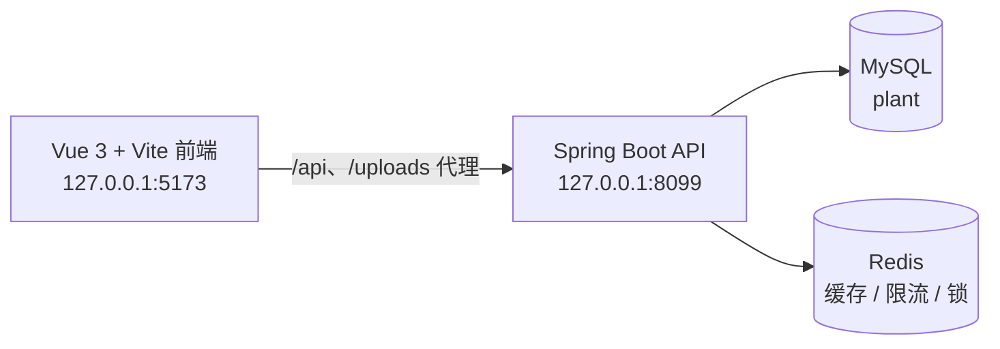

# 花吻陶（FlowerKissTao）

花吻陶是一个面向室内植物消费者的全栈应用：用户可以浏览植物、填写空间与养护画像、获取环境适配推荐、下单购买，并在收货后继续使用个性化养护计划与提醒。运营人员和管理员通过独立的后台页面管理商品、库存、订单、知识文章、推荐规则和账号权限。

[English README](README.en.md)


## 功能范围

- 植物目录、品种与 SKU 库存管理
- 基于光照、温湿度、空间、预算、宠物和养护习惯的植物推荐
- 注册、登录、JWT 会话、角色与权限控制
- 购物车、收货地址、下单、模拟支付、发货、收货和售后流程
- 购后植物档案、养护任务、健康报告、笔记和站内提醒
- 公开养护知识库，以及带发布流程的文章后台
- 运营看板、访问记录、操作日志和推荐权重配置

## 技术组成

| 部分 | 技术与入口 |
| --- | --- |
| 后端 | Java 17、Spring Boot 3.5.16、Spring Security、MyBatis-Plus、MySQL、Redis |
| 前端 | Vue 3、TypeScript、Vite、Vue Router、Pinia、Element Plus |
| 后端启动类 | `src/main/java/com/zyt/flowerkisstao/FlowerKissTaoApplication.java` |
| 前端入口 | `frontend/src/main.ts` |
| 数据库脚本 | `src/main/resources/db/schema.sql`、`src/main/resources/db/data.sql` |



前端开发服务器默认把 `/api` 和 `/uploads` 转发到 `http://127.0.0.1:8099`。后端默认监听 `8099`，数据库名为 `plant`，Redis 默认监听 `6386`；这些默认值可通过环境变量覆盖。

## 快速开始

### 1. 准备依赖

- JDK 17 或更高版本
- Maven
- Node.js `^22.18.0` 或 `>=24.12.0`
- pnpm 11（前端声明的包管理器为 `pnpm@11.9.0`）
- MySQL 和 Redis

### 2. 初始化 MySQL

在项目根目录执行。默认连接参数与 `src/main/resources/application.yml` 一致；请按本机环境替换用户名、密码或端口。

```bash
mysql -uroot -p -e "CREATE DATABASE IF NOT EXISTS plant CHARACTER SET utf8mb4 COLLATE utf8mb4_unicode_ci;"
mysql -uroot -p plant < src/main/resources/db/schema.sql
mysql -uroot -p plant < src/main/resources/db/data.sql
```

`data.sql` 会写入本地演示账号和初始植物、SKU、知识文章数据。生产环境请修改演示密码，并通过环境变量提供数据库密码、Redis 密码和 JWT 密钥。

### 3. 启动后端

```bash
mvn spring-boot:run
```

后端默认地址为 `http://127.0.0.1:8099`。

### 4. 启动前端

在另一个终端进入 `frontend/`：

```bash
cd frontend
pnpm install
pnpm dev
```

打开 `http://127.0.0.1:5173`。如果后端不在 8099 端口，可在 `frontend/.env` 中设置 `VITE_API_PROXY_TARGET`；API 前缀可通过 `VITE_API_BASE_URL` 调整，示例见 [`frontend/.env.example`](frontend/.env.example)。

### 5. 本地演示账号

| 账号 | 密码 | 角色 |
| --- | --- | --- |
| `admin` | `admin123` | 管理员 |
| `operator` | `operator123` | 运营 |
| `demo` | `user123` | 普通用户 |

登录后可从普通用户页面进入 `/admin`（需要对应权限的账号）。这些账号来自 `data.sql`，仅用于本地开发演示。

## 验证与构建

后端测试：

```bash
mvn test
```

前端类型检查与生产构建：

```bash
cd frontend
pnpm type-check
pnpm build
```

仓库还提供三个需要本地服务的验证脚本：

```bash
python scripts/verify_clean_init.py   # 临时数据库建表、灌数并启动 Spring 上下文
python scripts/verify_schema.py       # 对比 schema.sql 与现有数据库结构
python scripts/smoke_demo.py          # 验证注册、推荐、购物车、订单、养护和后台流程
```

`verify_clean_init.py` 只允许创建并删除名为 `plant_verify_flowerkisstao` 的临时数据库；`smoke_demo.py` 要求后端、数据库和 Redis 已准备好。

## 目录导航

```text
src/main/java/com/zyt/flowerkisstao/
├── catalog/          植物品种、SKU 与库存
├── recommendation/   推荐画像、算法与规则权重
├── trade/            购物车、地址、订单与售后
├── care/             植物档案、养护任务与提醒
├── knowledge/        养护知识与文章审核发布
├── user/             认证、资料、角色与权限
├── operation/        看板、访问记录与操作日志
└── shared/           通用响应、安全与基础设施

frontend/src/
├── app/              布局、路由与全局样式
├── modules/          home、catalog、recommendation、trade、care、knowledge、user、operation
└── shared/           请求、令牌、组件与会话状态
```

主要页面入口包括 `/plants`、`/recommendation`、`/care`、`/knowledge`、`/cart`、`/orders` 和 `/admin`。需要登录或权限的页面由前端路由守卫和后端 Spring Security 同时保护；前端守卫只负责体验，后端才是安全边界。

## API 入口

后端控制器统一使用 `/api` 前缀，主要资源包括：

- `/api/auth`：注册、登录、当前用户和退出登录
- `/api/catalog`：植物目录与详情
- `/api/recommendations`：生成和读取推荐结果
- `/api/care`：植物档案、养护任务与提醒
- `/api/knowledge`：公开知识文章与收藏反馈
- `/api/cart`、`/api/addresses`、`/api/orders`：交易流程
- `/api/admin/**`：商品、订单、文章、推荐规则、用户和运营管理

具体请求参数以 `src/main/java/com/zyt/flowerkisstao/**/web/controller` 下的控制器与 DTO 为准。

## 贡献

提交改动前，至少运行与改动相关的后端测试，以及前端 `pnpm type-check` 和 `pnpm build`。数据库结构变更时同步更新 `schema.sql`、必要的种子数据和验证脚本。

## 许可证

本项目使用 [MIT License](LICENSE)。
