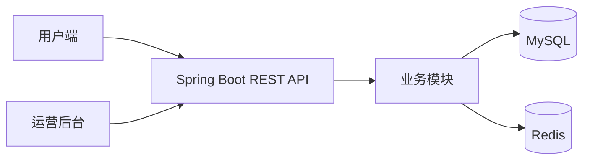

# 花吻陶 FlowerKissTao

花吻陶是面向植物消费者与运营人员的全栈植物电商和养护系统。
用户可以浏览植物、获得个性化推荐、完成购物与订单流程，并在购买后管理植物档案和养护提醒。
运营人员可以在后台管理商品、SKU、订单、知识文章、推荐规则、用户和运营日志。

## 功能

- 植物目录、分类筛选、植物详情与 SKU 库存展示
- 基于环境画像、偏好和预算的植物推荐
- 注册登录、角色权限、收货地址、购物车与订单管理
- 模拟支付、售后处理和运营订单管理
- 购后植物档案、养护任务、养护提醒与养护知识库
- 面向运营人员的看板、商品、文章、推荐规则、用户和日志管理

## 架构概览



MySQL 保存业务数据；Redis 由后端用于缓存、限流和分布式锁。前端通过 Vite 开发代理访问后端 `/api` 接口。

## 技术栈

| 分类 | 技术 | 版本 | 用途 |
| --- | --- | --- | --- |
| 后端运行时 | Java | 17 | Spring Boot 应用运行环境 |
| 后端框架 | Spring Boot | 3.5.16 | REST API、任务调度与应用启动 |
| 数据访问 | MyBatis-Plus | 3.5.15 | 数据库访问与分页 |
| 认证 | JJWT | 0.11.5 | JWT 签发与校验 |
| 数据库 | MySQL | 未固定 | 业务数据存储 |
| 缓存 | Redis | 未固定 | 缓存、限流和分布式锁 |
| 前端框架 | Vue | 3.5.40 | 用户端与运营后台界面 |
| 前端语言 | TypeScript | 6.0.3 | 前端类型检查 |
| 前端构建 | Vite | 8.1.5 | 开发服务器与生产构建 |
| UI 组件 | Element Plus | 2.14.3 | 界面组件 |
| 状态管理 | Pinia | 4.0.2 | 前端登录态与业务状态管理 |

## 项目结构

```text
FlowerKissTao/
├── frontend/src/app/         # 布局、路由和应用级页面
├── frontend/src/modules/     # 用户端与运营后台领域模块
├── frontend/package.json     # 前端脚本与依赖
├── src/main/java/.../        # Spring Boot 后端领域模块
├── src/main/resources/       # 应用配置与数据库资源
├── src/test/                 # 后端测试
├── scripts/                  # 数据库校验脚本
└── pom.xml                   # Maven 构建配置
```

## 环境要求

- JDK 17 或更高版本
- Maven
- Node.js `^22.18.0` 或 `>=24.12.0`
- pnpm 11.9.0
- MySQL 数据库 `plant`
- Redis 服务

## 快速开始

### 1. 准备数据库

创建名为 `plant` 的 MySQL 数据库，并依次执行 `src/main/resources/db/schema.sql` 和 `src/main/resources/db/data.sql`。
默认连接地址为 `127.0.0.1:3306`，用户名为 `root`，密码为 `123456`。

使用仓库脚本校验现有数据库结构，并验证全新数据库初始化流程：

```bash
python scripts/verify_schema.py plant
python scripts/verify_clean_init.py
```

### 2. 启动后端

在项目根目录执行：

```bash
mvn spring-boot:run
```

后端默认监听 `http://127.0.0.1:8099`。

### 3. 启动前端

```bash
cd frontend
pnpm install --frozen-lockfile
pnpm run dev
```

打开 `http://127.0.0.1:5173`。前端 `/api` 请求默认代理到 `http://127.0.0.1:8099`。

## 配置

后端默认配置位于 `src/main/resources/application.yml`，敏感值和不同环境的连接信息可通过环境变量覆盖：

| 配置 | 默认值 | 作用 |
| --- | --- | --- |
| `MYSQL_USERNAME` | `root` | MySQL 用户名 |
| `MYSQL_PASSWORD` | `123456` | MySQL 密码 |
| `REDIS_HOST` | `127.0.0.1` | Redis 地址 |
| `REDIS_PORT` | `6386` | Redis 端口 |
| `REDIS_PASSWORD` | `123456` | Redis 密码 |
| `REDIS_ENABLED` | `true` | Redis 基础能力总开关 |
| `REDIS_CACHE_ENABLED` | `true` | Redis 缓存开关 |
| `REDIS_RATE_LIMIT_ENABLED` | `true` | Redis 限流开关 |
| `JWT_SECRET` | 本地开发默认值 | JWT 签名密钥 |
| `JWT_EXPIRE_MINUTES` | `120` | JWT 有效期，单位为分钟 |

前端配置模板位于 `frontend/.env.example`：

| 配置 | 默认值 | 作用 |
| --- | --- | --- |
| `VITE_PUBLIC_BASE` | `/` | 前端部署基础路径 |
| `VITE_API_BASE_URL` | `/api` | API 基础路径 |
| `VITE_API_PROXY_TARGET` | `http://localhost:8099` | Vite 开发代理目标 |

## 演示账号

以下账号由开发数据提供，仅用于本地演示：

| 账号 | 密码 | 用途 |
| --- | --- | --- |
| `admin` | `admin123` | 管理员后台 |
| `operator` | `operator123` | 运营后台 |
| `demo` | `user123` | 用户端 |

## API 概览

接口控制器位于 `src/main/java/com/zyt/flowerkisstao/**/web/controller/`。

| 方法 | 路径 | 用途 | 来源 |
| --- | --- | --- | --- |
| POST | `/api/auth/register` | 注册账号 | `AuthController.java` |
| POST | `/api/auth/login` | 登录并获取令牌 | `AuthController.java` |
| GET | `/api/auth/me` | 获取当前登录用户 | `AuthController.java` |
| POST | `/api/auth/logout` | 统一登出入口 | `AuthController.java` |
| GET | `/api/catalog/plants` | 分页查询植物 | `PlantController.java` |
| GET | `/api/catalog/plants/{slug}` | 查询植物详情 | `PlantController.java` |
| GET | `/api/catalog/plant-facets` | 查询植物筛选项 | `PlantController.java` |
| GET | `/api/cart` | 查询当前用户购物车 | `CartController.java` |
| POST | `/api/cart` | 加入购物车 | `CartController.java` |
| PUT | `/api/cart/{skuId}` | 修改购物车数量 | `CartController.java` |
| DELETE | `/api/cart/{skuId}` | 移除购物车商品 | `CartController.java` |

更多接口按领域分布在 `care`、`knowledge`、`operation`、`recommendation`、`trade` 和 `user` 模块的控制器中。

## 测试与构建

后端测试和打包命令：

```bash
mvn test
mvn -DskipTests package
```

前端类型检查和生产构建命令：

```bash
cd frontend
pnpm run type-check
pnpm run build
```

## 安全与隐私

生产环境中的数据库密码、Redis 密码和 JWT 密钥应通过环境变量或私有配置注入，不要提交到仓库。演示账号和本地默认密码只适用于开发环境。

## License

当前仓库未提供独立的 `LICENSE` 文件。对外分发或开源前，请补充明确的许可证文本。
