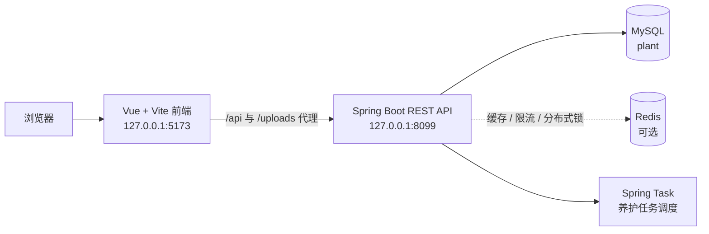

# 花吻陶 · FlowerKissTao

[English README](README.en.md) · [MIT License](LICENSE)

花吻陶是一个“先理解环境，再选择植物”的全栈植物服务。用户填写光照、空间、宠物安全和养护时间等条件后，系统筛选并排序合适的植物，支持从浏览、推荐到购买和购后养护的一条路径。


## ✨ 能做什么

- **智能推荐**：按光照、温度、湿度、空间、预算、偏好和养护难度进行硬过滤与加权排序，并返回推荐理由。
- **植物目录**：浏览植物品种与 SKU，查看规格、库存和养护属性。
- **养护计划**：收货后生成植物档案、养护任务、提醒、健康记录和复评入口。
- **知识库**：公开阅读养护文章；登录后可收藏并反馈文章是否有帮助。
- **交易流程**：地址、购物车、订单、模拟支付、发货、收货和售后状态流转。
- **运营后台**：商品、SKU、订单、知识文章、推荐权重、用户和操作日志均按角色权限控制。

## 运行关系



## 🚀 快速开始

### 1. 准备依赖

- Java 17 或更高版本（Maven 编译目标为 17）
- Maven
- Node.js `^22.18.0` 或 `>=24.12.0`
- pnpm `11.9.0`
- MySQL（创建名为 `plant` 的数据库）
- Redis：默认连接 `127.0.0.1:6386`；没有 Redis 时可在启动前设置 `REDIS_ENABLED=false`

### 2. 初始化 MySQL

在仓库根目录执行。命令中的用户名和密码请替换为本机配置：

```powershell
mysql -u root -p -e "CREATE DATABASE IF NOT EXISTS plant CHARACTER SET utf8mb4 COLLATE utf8mb4_unicode_ci"
Get-Content .\src\main\resources\db\schema.sql | mysql -u root -p plant
Get-Content .\src\main\resources\db\data.sql   | mysql -u root -p plant
```

`schema.sql` 建表，`data.sql` 写入角色、权限、植物、SKU 和知识文章种子数据。脚本会创建 24 张业务表，并提供 `admin`、`operator`、`demo` 三类本地演示账号；生产环境请更换密码和 JWT 密钥。

### 3. 启动后端

```powershell
mvn spring-boot:run
```

后端 API 监听 `http://127.0.0.1:8099`。Redis 或 JWT 配置可通过环境变量覆盖；MySQL 用户名和密码使用 `MYSQL_USERNAME` / `MYSQL_PASSWORD`。

### 4. 启动前端

另开终端：

```powershell
cd frontend
pnpm install --frozen-lockfile
pnpm dev
```

打开 <http://127.0.0.1:5173>。Vite 会把 `/api` 和 `/uploads` 转发到 `VITE_API_PROXY_TARGET`（默认 `http://localhost:8099`）。可复制 `frontend/.env.example` 为本地环境文件后再调整公开路径或代理地址。

## 🧪 检查与测试

```powershell
# 后端单元测试与 Spring 上下文测试
mvn test

# 前端类型检查与生产构建
cd frontend
pnpm type-check
pnpm build
```

返回仓库根目录后再运行后端脚本：

```powershell
cd ..
```

需要已启动后端、已初始化数据库的端到端冒烟流程：

```powershell
python scripts/smoke_demo.py
```

该脚本会注册临时用户，依次验证推荐、购物车、下单、幂等支付、管理员发货、收货和养护维护，默认结束后清理临时数据。数据库专项检查：

```powershell
python scripts/verify_clean_init.py   # 临时库建表、灌库并启动 Spring 上下文
python scripts/verify_schema.py       # 对比 schema.sql 与现有数据库
```

## 🔌 API 区域

后端控制器按领域组织，统一挂在 `/api` 下：

| 区域 | 路径 | 说明 |
| --- | --- | --- |
| 认证 | `/api/auth` | 注册、登录、当前用户与退出 |
| 目录 | `/api/catalog` | 植物列表、详情和筛选项（公开 GET） |
| 推荐 | `/api/profiles`、`/api/recommendations` | 场景画像与推荐结果 |
| 养护 | `/api/care` | 档案、任务、提醒、健康报告和维护调度 |
| 知识 | `/api/knowledge` | 文章、筛选、推荐和收藏 |
| 交易 | `/api/cart`、`/api/orders`、`/api/addresses` | 购物车、订单和地址 |
| 后台 | `/api/admin/**` | 商品、订单、内容、推荐规则、用户和运营数据 |

完整路由以 `src/main/java/**/web/controller` 中的控制器定义为准。

## 关键配置

| 变量 | 默认值 | 用途 |
| --- | --- | --- |
| `MYSQL_USERNAME` / `MYSQL_PASSWORD` | `root` / 本地默认值 | MySQL 登录信息 |
| `REDIS_HOST` / `REDIS_PORT` | `127.0.0.1` / `6386` | Redis 地址 |
| `REDIS_ENABLED` | `true` | 缓存、限流和分布式锁总开关 |
| `APP_UPLOAD_DIR` | `uploads` | 头像等上传文件目录 |
| `JWT_SECRET` / `JWT_EXPIRE_MINUTES` | 本地开发默认值 / `120` | JWT 签名密钥与有效期（分钟） |
| `VITE_API_PROXY_TARGET` | `http://localhost:8099` | 前端开发服务器代理目标 |

生产环境必须通过安全的环境变量或密钥管理系统注入数据库密码、Redis 密码和 JWT 密钥。

## 目录速览

```text
src/main/java/com/zyt/flowerkisstao/
├── catalog/          # 植物品种与 SKU
├── recommendation/   # 推荐模型、权重与结果
├── care/             # 养护档案、任务和提醒
├── knowledge/        # 养护文章
├── trade/            # 购物车、地址和订单
├── user/             # 认证、画像和 RBAC
├── operation/        # 看板、访问与操作日志
└── shared/           # 安全、缓存和通用配置
frontend/src/modules/ # 与后端领域对应的 Vue 页面、状态和 API
src/main/resources/db # schema.sql 与 data.sql
scripts/              # 冒烟、初始化和 schema 校验脚本
```

## 参与开发

修改后请至少运行对应端的类型检查、构建或测试。新增数据库字段时同步更新 `schema.sql`、实体和映射，并用 `verify_schema.py` 检查结构一致性。

## 许可证

本项目以 [MIT License](LICENSE) 发布。


