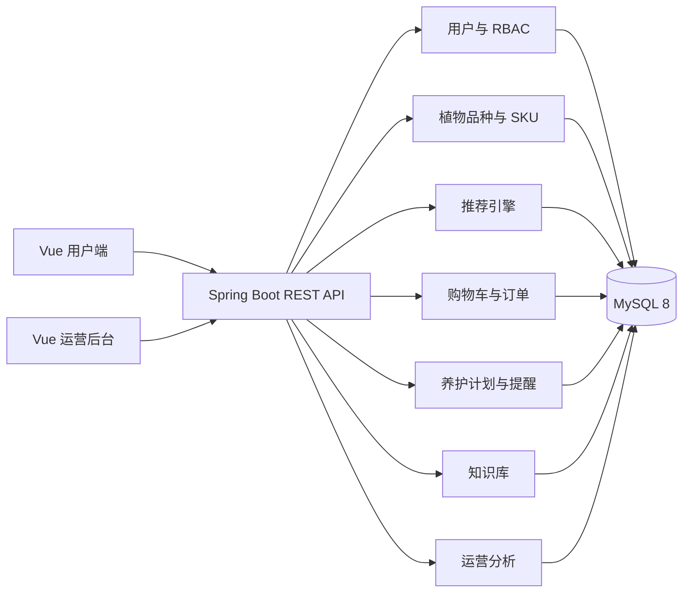

<h1 align="center">FlowerKissTao · 花吻陶</h1>

<p align="center">
  <strong>融合环境画像、可解释推荐、订单交易与购后养护的花卉绿植电商系统</strong>
</p>

<p align="center">
  
  
  
  
  
  
</p>

## 项目简介

FlowerKissTao 面向缺乏植物选购与养护经验的家庭及办公用户，将商品检索、环境适配推荐、订单交易和购后养护连接成完整业务闭环。

系统不会只按销量推荐植物，而是结合用户的摆放位置、光照、温湿度、空间、预算、儿童与宠物安全条件，以及养护经验、浇水频率和出差情况进行筛选与打分。用户完成购买并确认收货后，系统会自动建立“我的植物”档案、生成养护任务并发送站内提醒。

```text
环境画像 → 可解释推荐 → 商品规格 → 购物车与订单 → 确认收货 → 养护计划 → 知识内容
```

## 核心功能

- **用户与权限**：注册、登录、JWT、Spring Security、RBAC，以及普通用户、运营、管理员三角色权限边界。
- **环境画像**：多场景问卷，记录光照、温湿度、空间、预算、安全条件和养护能力。
- **可解释推荐**：安全硬过滤、七维加权评分、分项得分、推荐理由、风险提示、无候选诊断和权重快照。
- **商品与交易**：品种/SKU 分层、规格选择、服务端购物车、地址簿、订单状态机、模拟支付与售后审核。
- **库存一致性**：使用条件更新原子扣减库存，结合支付幂等标识避免超卖和重复处理。
- **购后养护**：确认收货自动建档，生成浇水、施肥、换盆、修剪、转向补光和病虫害预防任务。
- **知识科普**：结构化知识文章、多维检索、收藏与有用反馈，以及基于已购植物和近期任务的内容推荐。
- **运营后台**：运营看板、推荐权重预览、品种与库存管理、订单售后、文章审核、用户管理和操作日志。

## 技术栈

| 范围 | 技术 |
|---|---|
| 后端语言 | Java 17 |
| Web 框架 | Spring Boot 3.5.16 |
| 认证授权 | Spring Security、JWT、BCrypt、RBAC |
| 数据访问 | MyBatis-Plus 3.5.15 |
| 数据库 | MySQL 8 |
| 定时任务 | Spring Task |
| 前端 | Vue 3.5.40、TypeScript 6、Vite 8 |
| UI 与状态 | Element Plus、Pinia、Vue Router |
| 构建工具 | Maven、npm / pnpm |
| 测试 | JUnit 5、Spring Boot Test、Python 接口验证脚本 |

## 系统结构



推荐、订单、养护和知识推荐中的关键规则分别抽成不依赖 Spring 的纯函数领域服务：

- `RecommendationEngine`：硬过滤、七维评分、排序与理由生成；
- `OrderTransition`：六状态订单流转；
- `CareTaskPlanner`：任务排期与季节/环境系数；
- `ArticleTransition`：知识文章审核流转；
- `KnowledgeRecommender`：按已购品种与养护行为推荐内容。

## 项目目录

```text
FlowerKissTao/
├─ src/main/java/com/zyt/flowerkisstao/
│  ├─ user/                # 账户、角色、环境画像
│  ├─ catalog/             # 植物品种与 SKU
│  ├─ recommendation/      # 推荐算法、权重与快照
│  ├─ trade/               # 地址、购物车、订单与售后
│  ├─ care/                # 养护档案、任务与提醒
│  ├─ knowledge/           # 文章、检索与内容推荐
│  ├─ operation/           # 看板、访问日志与操作审计
│  └─ shared/              # 安全、异常、配置与统一响应
├─ src/main/resources/db/
│  ├─ schema.sql           # 24 张表的完整结构
│  └─ data.sql             # 角色、账号、商品与文章种子数据
├─ src/test/java/          # 纯函数规则与上下文测试
├─ frontend/src/
│  ├─ app/                 # Router、ShopLayout、AdminLayout
│  ├─ modules/             # 前端领域模块
│  └─ shared/              # API、权限与公共组件
├─ scripts/
│  ├─ verify_schema.py     # schema 与当前数据库漂移检查
│  └─ verify_clean_init.py # 临时空库初始化与 Spring 上下文验证
├─ pom.xml
└─ frontend/package.json
```

## 快速开始

### 环境要求

- JDK 17 或更高版本
- Maven 3.9+
- MySQL 8
- Node.js `^22.18.0` 或 `>=24.12.0`
- npm；仓库同时包含 pnpm lockfile，也可使用 pnpm
- Python 3（仅运行数据库/接口验证脚本时需要）

### 1. 初始化数据库

创建数据库后依次执行：

```bash
mysql -u root -p -e "CREATE DATABASE plant CHARACTER SET utf8mb4 COLLATE utf8mb4_unicode_ci;"
mysql -u root -p plant < src/main/resources/db/schema.sql
mysql -u root -p plant < src/main/resources/db/data.sql
```

数据库连接信息由 Spring 配置读取，可通过以下环境变量覆盖：

```text
MYSQL_USERNAME
MYSQL_PASSWORD
SPRING_DATASOURCE_URL
JWT_SECRET
JWT_EXPIRE_MINUTES
```

### 2. 启动后端

```bash
mvn spring-boot:run
```

默认后端端口来自项目 Spring 配置；前端开发代理可通过 `VITE_API_PROXY_TARGET` 指向实际后端地址。

### 3. 启动前端

```bash
cd frontend
npm install
npm run dev
```

Vite 开发服务器默认运行在 `http://127.0.0.1:5173`。

### 4. 构建

```bash
mvn package
cd frontend && npm run build
```

`npm run build` 会先执行 TypeScript 类型检查，再执行 Vite 生产构建；不要求全局安装 pnpm。

## 种子账号

`data.sql` 提供三类本地演示账号：

| 用户名 | 角色 | 主要用途 |
|---|---|---|
| `demo` | 普通用户 | 问卷、推荐、购物车、订单、养护与收藏 |
| `operator` | 运营 | 商品、订单、知识、推荐配置、看板与日志 |
| `admin` | 管理员 | 全部后台功能，包括账号和角色管理 |

账号密码保存在数据库种子文件的 BCrypt 哈希中。请以项目初始化后的本地演示凭据或实际创建的账号登录，不要在公开文档中传播生产凭据。

## 核心业务流程

### 可解释推荐

1. 用户选择或创建环境场景；
2. 系统执行宠物/儿童安全、光照、空间、预算和浇水频次硬过滤；
3. 对候选按光照、温度、湿度、养护能力、空间、预算和偏好计算加权得分；
4. 返回 Top-N、七维分项得分、理由、风险提示和过滤诊断；
5. 推荐结果保存权重快照，后续修改权重不会改变历史解释。

默认权重为：光照 30%、温度 15%、湿度 10%、养护能力 20%、空间 10%、预算 10%、偏好 5%。

### 订单与库存

订单状态包括待付款、待发货、运输中、已完成、已取消和售后中。创建订单时，系统使用带库存条件的原子更新扣减 SKU 库存；模拟支付使用订单状态条件更新和唯一幂等标识，避免重复处理。

### 购后养护

确认收货后自动建立养护档案，并根据品种字段、环境场景与当前季节生成未来任务。Spring Task 每日补足任务窗口、标记逾期、生成提醒并检测光照变化。用户可完成、跳过、延后任务，记录文字或小尺寸图片，并提交植物状态反馈获取排查建议。

## API 概览

项目接口较多，下面只列核心分组；具体方法与路径以对应 Controller 为准。

| 分组 | 主要入口 | 控制器 |
|---|---|---|
| 认证 | `/api/auth/**` | `AuthController` |
| 环境画像 | `/api/profiles/**` | `SceneProfileController` |
| 商品查询 | `/api/catalog/**` | `PlantController` |
| 推荐 | `/api/recommendations/**` | `RecommendationController` |
| 地址与购物车 | `/api/addresses/**`、`/api/cart/**` | `AddressController`、`CartController` |
| 订单 | `/api/orders/**`、`/api/admin/orders/**` | `OrderController`、`OrderAdminController` |
| 养护 | `/api/care/**` | `CareArchiveController`、`CareNotificationController` |
| 知识库 | `/api/knowledge/**`、`/api/admin/knowledge/**` | `KnowledgeController`、`KnowledgeAdminController` |
| 运营后台 | `/api/admin/operation/**` | `OperationDashboardController`、`OperationLogController` |
| 后台商品/用户 | `/api/admin/species/**`、`/api/admin/skus/**`、`/api/admin/users/**` | 对应 Admin Controller |

商品与已发布知识文章的 GET 接口对游客开放；画像、推荐、购物车、订单、养护及后台接口受认证和权限控制。

## 测试与验证

运行后端测试：

```bash
mvn test
```

当前测试集包含 70 项，覆盖推荐算法、订单状态机、养护任务规划、文章审核状态机、知识推荐与 Spring 上下文。

验证当前数据库与 `schema.sql` 是否一致：

```bash
python scripts/verify_schema.py
```

验证空库是否能完整执行 `schema.sql` + `data.sql` 并启动 Spring 上下文：

```bash
python scripts/verify_clean_init.py
```

后者只会创建并删除专用临时数据库 `plant_verify_flowerkisstao`，不会修改正常的 `plant` 数据库。

## 设计与实现说明

- 前端视觉与交互规范见 `DESIGN.md`。
- 产品定位与设计原则见 `PRODUCT.md`。
- 数据库不依赖运行时自动建表，完整结构与种子数据分别维护在 `schema.sql` 和 `data.sql`。
- 图片型成长记录当前以受大小限制的 base64 数据保存；商品图片使用静态资源路径。
- 支付是可演示的模拟流程，不会接入真实支付渠道。
- 操作日志采用显式白名单字段记录，避免将密码、地址和图片等敏感数据写入审计表。

## 安全与隐私

项目使用 BCrypt 保存密码，并通过 JWT、Spring Security 与权限点控制接口访问。生产部署时，数据库密码、JWT 密钥和其他私有配置应通过环境变量或私有配置注入，不建议提交到仓库。

环境画像、收货地址、订单与养护记录属于用户私有数据。演示、测试和截图时应使用种子账号及脱敏数据；页面访问日志只记录页面路径类型，不记录请求正文。

## License

当前仓库未提供独立的 `LICENSE` 文件。对外分发或开源前，请先补充明确的许可证文本。
