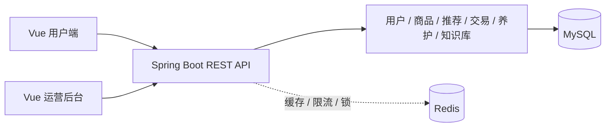

# FlowerKissTao · 花吻陶

FlowerKissTao 是面向家庭和办公用户的花卉绿植电商系统。用户可以浏览植物、填写环境画像、获得可解释推荐、完成购物车和订单流程，并在确认收货后管理植物档案、养护任务和站内提醒。项目同时提供面向运营人员的商品、订单、知识文章、推荐规则、用户和操作日志后台。

## 核心功能

- 用户注册、登录、JWT 鉴权和基于角色与权限点的访问控制。
- 环境画像与可解释植物推荐。
- 植物品种、SKU、规格和库存管理。
- 地址簿、购物车、订单、模拟支付和售后流程。
- 确认收货后建立植物档案并生成养护任务和提醒。
- 已发布知识文章的公开检索、收藏、有用反馈和推荐。
- 运营看板、商品管理、订单售后、文章审核、推荐规则、用户管理和操作日志。
- Redis 缓存、接口限流和养护定时任务协调；Redis 不可用时公开查询回源 MySQL。

## 技术栈

| 范围 | 技术 | 版本或说明 |
|---|---|---|
| 后端语言 | Java | 17+ |
| Web 框架 | Spring Boot | 3.5.16 |
| 认证授权 | Spring Security、JWT、BCrypt | JWT 默认有效期 120 分钟 |
| 数据访问 | MyBatis-Plus | 3.5.15 |
| 事实数据库 | MySQL | 8 |
| 缓存与基础设施 | Redis 服务 | 应用默认连接 `127.0.0.1:6386` |
| 前端 | Vue、TypeScript、Vite | 3.5.40、6、8.1.5 |
| UI 与状态 | Element Plus、Pinia、Vue Router | 2.14.3、4.0.2、5.2.0 |
| 构建与测试 | Maven、pnpm、JUnit 5、Python | 见下方命令 |

## 系统结构



## 项目结构

```text
FlowerKissTao/
├─ src/main/java/com/zyt/flowerkisstao/  # 后端领域模块
├─ src/main/resources/db/                # schema.sql 与 data.sql
├─ src/test/java/                        # 后端测试
├─ frontend/src/                         # Vue 用户端与运营后台
├─ scripts/                              # 数据库校验脚本
├─ pom.xml
└─ frontend/package.json
```

## 快速开始

### 环境要求

- JDK 17 或更高版本。
- Maven 3.9 或更高版本。
- MySQL 8。
- Node.js `^22.18.0` 或 `>=24.12.0`。
- pnpm 11.9.0；版本由 `frontend/package.json` 的 `packageManager` 字段声明。
- Python 3 仅用于运行数据库校验脚本。
- Redis 兼容服务。应用默认连接 `127.0.0.1:6386`，密码为 `123456`。

### 初始化 MySQL

创建数据库并执行结构和种子数据：

```bash
mysql -u root -p -e "CREATE DATABASE plant CHARACTER SET utf8mb4 COLLATE utf8mb4_unicode_ci;"
mysql -u root -p plant < src/main/resources/db/schema.sql
mysql -u root -p plant < src/main/resources/db/data.sql
```

### 配置后端

默认配置位于 `src/main/resources/application.yml`。常用环境变量如下：

| 环境变量 | 默认值 | 作用 |
|---|---|---|
| `MYSQL_USERNAME` | `root` | MySQL 用户名 |
| `MYSQL_PASSWORD` | `123456` | MySQL 密码 |
| `SPRING_DATASOURCE_URL` | 配置文件中的 `plant` 地址 | 覆盖完整 JDBC 地址 |
| `REDIS_HOST` | `127.0.0.1` | Redis 地址 |
| `REDIS_PORT` | `6386` | Redis 端口 |
| `REDIS_PASSWORD` | `123456` | Redis 密码 |
| `REDIS_ENABLED` | `true` | 是否启用 Redis 基础能力 |
| `REDIS_CACHE_ENABLED` | `true` | 是否启用缓存读写 |
| `JWT_SECRET` | 本地开发默认值 | JWT 签名密钥 |
| `JWT_EXPIRE_MINUTES` | `120` | JWT 有效期，单位为分钟 |

生产环境不要使用配置文件中的默认密码和 JWT 密钥，应通过环境变量或私有配置注入。

### 启动后端

```bash
mvn spring-boot:run
```

后端默认监听 `http://127.0.0.1:8099`。

### 安装并启动前端

```bash
cd frontend
pnpm install --frozen-lockfile
pnpm run dev
```

前端默认监听 `http://127.0.0.1:5173`，`/api` 请求代理到 `http://127.0.0.1:8099`。可通过 `VITE_API_PROXY_TARGET` 覆盖代理目标。

## 演示账号

`src/main/resources/db/data.sql` 提供本地演示账号。密码仅用于本地开发和验收：

| 用户名 | 密码 | 角色 | 用途 |
|---|---|---|---|
| `demo` | `user123` | 普通用户 | 画像、推荐、购物车、订单和养护 |
| `operator` | `operator123` | 运营 | 商品、订单、知识、推荐规则、看板和日志 |
| `admin` | `admin123` | 管理员 | 后台全部功能 |

运营后台入口为 `http://127.0.0.1:5173/admin`。退出后台后会清理本地登录态并返回商城首页。

## API 概览

后端接口按领域组织，完整路径以对应 Controller 为准：

| 分组 | 路径 | 控制器 |
|---|---|---|
| 认证 | `/api/auth/**` | `AuthController` |
| 画像 | `/api/profiles/**` | `SceneProfileController` |
| 商品查询 | `/api/catalog/**` | `PlantController` |
| 推荐 | `/api/recommendations/**` | `RecommendationController` |
| 地址与购物车 | `/api/addresses/**`、`/api/cart/**` | `AddressController`、`CartController` |
| 订单 | `/api/orders/**`、`/api/admin/orders/**` | `OrderController`、`OrderAdminController` |
| 养护 | `/api/care/**` | `CareArchiveController`、`CareNotificationController` |
| 知识库 | `/api/knowledge/**` | `KnowledgeController` |
| 运营后台 | `/api/admin/**` | 各领域 Admin Controller |

商品目录和公开知识内容支持游客访问；画像、推荐、购物车、订单、养护及运营后台接口需要登录或对应权限。

## Redis 说明

Redis 在本项目中只承担旁路能力：查询缓存、购物车展示快照、接口限流和养护任务分布式锁。订单、支付、库存、地址、购物车事实数据、用户画像和养护记录仍以 MySQL 为唯一权威来源。

Redis 不可用时，公开商品和知识库查询会回源 MySQL；缓存写入失败不会回滚已经成功的数据库事务。缓存开关可通过 `REDIS_ENABLED=false` 和 `REDIS_CACHE_ENABLED=false` 关闭。

## 测试与验证

运行后端测试：

```bash
mvn test
```

打包后端：

```bash
mvn -DskipTests package
```

运行前端类型检查和生产构建：

```bash
cd frontend
pnpm run type-check
pnpm run build
```

检查当前数据库是否与 `schema.sql` 的表、字段和索引一致：

```bash
python scripts/verify_schema.py plant
```

验证专用空数据库初始化和 Spring 上下文启动：

```bash
python scripts/verify_clean_init.py
```

该脚本使用并删除专用数据库 `plant_verify_flowerkisstao`，不修改正常的 `plant` 数据库。

## 设计文档

- 后端数据库结构：[`src/main/resources/db/schema.sql`](src/main/resources/db/schema.sql)
- 数据库种子数据：[`src/main/resources/db/data.sql`](src/main/resources/db/data.sql)
- 前端路由：[`frontend/src/app/router/index.ts`](frontend/src/app/router/index.ts)

## 安全与隐私

项目使用 BCrypt 保存密码，并通过 JWT、Spring Security 和权限点控制接口访问。环境画像、收货地址、订单和养护记录属于用户私有数据。演示、测试和截图使用脱敏数据，不要把生产密码、JWT 密钥或其他私有凭据提交到仓库。

## License

当前仓库未提供独立的 `LICENSE` 文件。对外分发或开源前，请补充明确的许可证文本。
