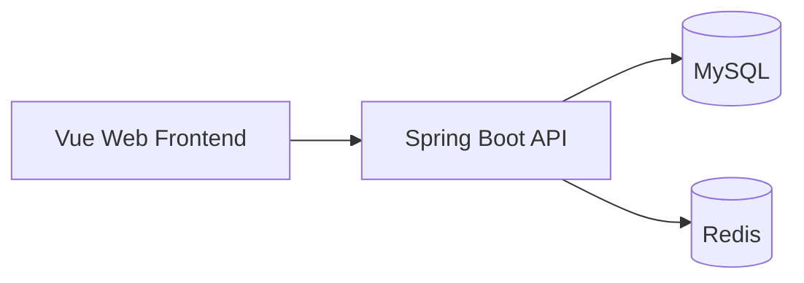

# FlowerKissTao

FlowerKissTao 是一个面向家庭植物用户的全栈植物服务应用，覆盖植物浏览、环境匹配推荐、购物交易，以及收货后的养护计划与成长记录。运营人员可以通过后台维护商品、知识内容、订单、用户和运营数据。

[English Documentation](./README.en.md)

## 功能

- 浏览植物目录、详情和可用筛选条件。
- 根据光照、温度、湿度、空间、预算和偏好生成植物推荐，并支持配置推荐权重。
- 支持注册、登录、JWT 认证、场景档案、购物车、收货地址和订单状态流转。
- 收货后建立植物养护档案，生成养护任务，支持完成、跳过、延期、健康复评和成长记录。
- 提供养护知识文章、推荐内容、收藏和有用反馈。
- 提供基于角色与权限的运营后台，覆盖商品、知识、订单、用户、角色和运营数据。

## 架构概览



前端通过 `/api` 访问后端 API；后端使用 MySQL 保存业务数据，并使用 Redis 提供缓存、限流和分布式锁能力。后端 API 控制器位于 `src/main/java/com/zyt/flowerkisstao/**/web/controller`。

## 项目结构

```text
.
├── pom.xml                         # Spring Boot 后端构建配置
├── src/main/java/...               # 后端模块与 API
├── src/main/resources/             # 后端配置、MySQL 建表与初始数据
├── src/test/java/...               # 后端测试
├── frontend/package.json           # 前端脚本与依赖
├── frontend/src/                   # Vue 页面、模块与共享组件
├── frontend/.env.example           # 前端环境变量样例
└── scripts/                        # 数据库验证脚本
```

## 技术栈

| 类别 | 技术 | 版本 | 用途 |
| --- | --- | --- | --- |
| 后端运行时 | Java | 17 | 编译目标 |
| 后端框架 | Spring Boot | 3.5.16 | Web、鉴权、参数校验与任务调度 |
| 数据访问 | MyBatis-Plus | 3.5.15 | MySQL 数据访问与分页 |
| 数据库 | MySQL | — | 业务数据存储 |
| 缓存与限流 | Redis | — | 缓存、限流与分布式锁 |
| 前端框架 | Vue | 3.5.40 | 用户端与运营后台界面 |
| 前端构建 | Vite | 8.1.5 | 开发服务器与生产构建 |
| 前端包管理 | pnpm | 11.9.0 | 前端依赖管理 |

## 环境要求

- JDK 17 或更高版本。
- Maven。
- Node.js `^22.18.0` 或 `>=24.12.0`。
- pnpm `11.9.0`。
- MySQL 和 Redis。

默认配置连接 MySQL `127.0.0.1:3306` 的 `plant` 数据库，以及 Redis `127.0.0.1:6386`。

## 快速开始

### 初始化数据库

按顺序执行 [`schema.sql`](./src/main/resources/db/schema.sql) 和 [`data.sql`](./src/main/resources/db/data.sql)，创建 `plant` 数据库的表结构与初始数据。应用默认连接参数位于 [`application.yml`](./src/main/resources/application.yml)。

验证全新数据库初始化：

```powershell
python scripts/verify_clean_init.py
```

该脚本使用临时数据库 `plant_verify_flowerkisstao`，并在结束时删除该数据库。

### 启动后端

```powershell
mvn spring-boot:run
```

后端默认监听 `http://127.0.0.1:8099`。

后端测试和打包：

```powershell
mvn test
mvn package
```

### 启动前端

```powershell
cd frontend
pnpm install
pnpm dev
```

前端开发服务器默认监听 `http://127.0.0.1:5173`，并将 `/api` 代理到 `http://127.0.0.1:8099`。

前端类型检查和生产构建：

```powershell
pnpm type-check
pnpm build
```

## 配置参考

后端配置位于 [`application.yml`](./src/main/resources/application.yml)，常用环境变量如下：

| 变量 | 默认值 | 作用 |
| --- | --- | --- |
| `MYSQL_USERNAME` | `root` | MySQL 用户名 |
| `MYSQL_PASSWORD` | `123456` | MySQL 密码 |
| `REDIS_HOST` | `127.0.0.1` | Redis 主机 |
| `REDIS_PORT` | `6386` | Redis 端口 |
| `REDIS_PASSWORD` | `123456` | Redis 密码 |
| `REDIS_ENABLED` | `true` | 是否启用 Redis 能力 |
| `JWT_SECRET` | 本地开发默认值 | JWT 签名密钥 |
| `JWT_EXPIRE_MINUTES` | `120` | JWT 有效期，单位为分钟 |

前端配置样例位于 [`frontend/.env.example`](./frontend/.env.example)：

| 变量 | 作用 |
| --- | --- |
| `VITE_PUBLIC_BASE` | 静态资源基础路径 |
| `VITE_API_BASE_URL` | API 前缀 |
| `VITE_API_PROXY_TARGET` | Vite 开发代理目标 |

生产环境请通过环境变量注入密码、JWT 密钥和 Redis 凭据，不要提交真实凭据。

## API 概览

后端 API 统一使用 `/api` 前缀。主要模块如下：

| 模块 | 路径前缀 | 能力 |
| --- | --- | --- |
| 认证 | `/api/auth` | 注册、登录、当前用户和退出 |
| 植物目录 | `/api/catalog` | 植物查询与筛选 |
| 推荐 | `/api/recommendations` | 生成、查看与反馈推荐 |
| 交易 | `/api/cart`、`/api/orders`、`/api/addresses` | 购物车、订单与地址 |
| 养护 | `/api/care` | 养护档案、任务、复评、记录与通知 |
| 知识 | `/api/knowledge` | 文章、推荐、收藏与反馈 |
| 运营后台 | `/api/admin/**` | 商品、知识、订单、用户、角色与运营数据 |

## 开发验证

后端测试：

```powershell
mvn test
```

数据库结构比对脚本只读取目标数据库：

```powershell
python scripts/verify_schema.py
```

## 安全与隐私

项目处理用户账号、地址、订单和养护记录等数据。默认配置用于本地开发；生产环境的密码、JWT 密钥和 Redis 凭据应通过环境变量或私有配置注入。演示、测试和截图请使用脱敏数据。

## License

本项目采用 [MIT License](./LICENSE)。

