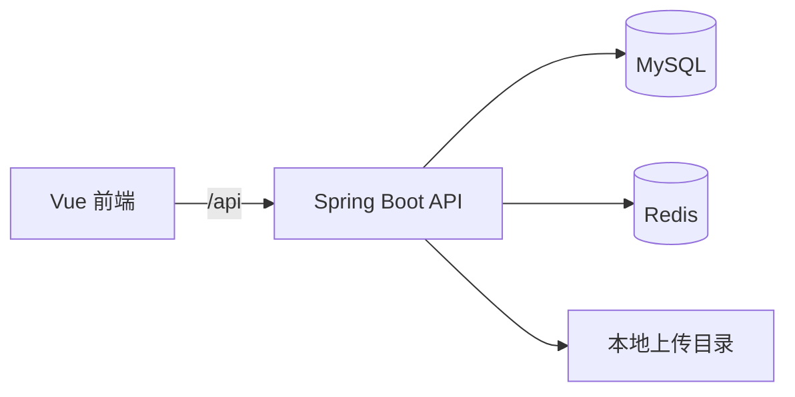

# FlowerKissTao

FlowerKissTao 是一个面向家庭植物用户的全栈植物服务应用。用户可以浏览植物、填写家庭环境画像、获得匹配推荐、体验购物流程，并在确认收货后管理养护计划。当前支付采用模拟流程。运营人员可以在后台维护商品、知识文章、订单、用户和运营数据。

[English documentation](./README.en.md) · [返回项目首页](./README.md)

[快速开始](#快速开始) · [配置](#配置) · [API 概览](#api-概览)

## 你可以用它做什么

- 浏览植物目录、详情和筛选条件。
- 按安全和环境规则筛选植物，再根据光照、温度、湿度、养护能力、空间、预算和偏好加权排序。
- 注册、登录并管理场景画像、购物车、收货地址、订单和个人资料。
- 在 `/profile` 修改用户名、昵称，验证当前密码后改密；支持上传不超过 2 MB 的 JPG、PNG、GIF 头像。
- 确认收货后建立植物档案和养护任务，支持完成、跳过、延期、健康复评、提醒和手动添加成长记录。
- 阅读养护知识，收藏文章并提交“有用”反馈。
- 在运营后台管理品种、SKU、知识文章、订单、用户角色和运营数据。

## 运行关系



前端开发服务器将 `/api` 和 `/uploads` 代理到后端。MySQL 保存业务数据，Redis 用于缓存、限流和分布式锁。头像经过校验、缩放和 PNG 重编码后保存在 `APP_UPLOAD_DIR` 下的 `avatars/` 目录，最长边为 512 像素；成长记录中的图片使用独立的 Base64 存储方式。

## 技术栈

| 部分 | 技术 | 版本或说明 |
| --- | --- | --- |
| 后端 | Java | 17 编译目标 |
| Web 与安全 | Spring Boot、Spring Security | Spring Boot 3.5.16，安全组件版本由其管理 |
| 数据访问 | MyBatis-Plus | 3.5.15 |
| 数据库 | MySQL | 默认库名 `plant` |
| 缓存与限流 | Redis | 默认端口 `6386` |
| 前端 | Vue、Vue Router、Pinia、Element Plus | Vue 3.5.40 |
| 构建 | Vite | 8.1.5 |
| 包管理 | pnpm | 11.9.0 |

## 环境要求

- JDK 17 或更高版本。
- Maven。
- Node.js `^22.18.0` 或 `>=24.12.0`。
- pnpm 11.9.0。
- MySQL 和 Redis。

默认配置连接 `127.0.0.1:3306` 的 `plant` 数据库，以及 `127.0.0.1:6386` 的 Redis。先启动这两个服务，并根据下方配置表设置连接凭据；更换 MySQL 主机或库名时设置 `SPRING_DATASOURCE_URL`。

## 快速开始

### 1. 初始化数据库

以下步骤用于全新数据库。在项目根目录打开终端，使用 MySQL 客户端连接本地数据库，按提示输入数据库密码：

```powershell
mysql --host=127.0.0.1 --port=3306 --user=root --password --default-character-set=utf8mb4
```

进入 MySQL 客户端后依次执行：

```sql
CREATE DATABASE plant CHARACTER SET utf8mb4;
USE plant;
SOURCE src/main/resources/db/schema.sql;
SOURCE src/main/resources/db/data.sql;
EXIT;
```

建表脚本会重建表，已有业务数据时不要重复执行。当前仓库仅包含建表和种子数据脚本，没有独立的增量迁移目录；升级已有库时，先备份并比对结构。后端连接配置见 [`application.yml`](./src/main/resources/application.yml)。

### 2. 启动后端

在项目根目录运行：

```powershell
mvn spring-boot:run
```

后端默认监听 `http://127.0.0.1:8099`。

### 3. 启动前端

在另一个终端运行：

```powershell
cd frontend
pnpm install
pnpm dev
```

前端默认监听 [http://127.0.0.1:5173](http://127.0.0.1:5173)。先在 `/plants` 浏览植物，再通过 `/login` 注册账号，进入 `/recommendation` 填写环境画像并生成推荐。点击顶部头像可打开 `/profile` 修改个人资料。

## 开发命令

以下后端命令在项目根目录运行。测试包含访问 MySQL 的集成测试，需要可用数据库；测试创建的资料会通过事务回滚清理。

```powershell
mvn test
mvn package
```

前端：

```powershell
cd frontend
pnpm type-check
pnpm build
```

可选数据库验证需要 Python 3，以及 PATH 中可用的 MySQL 客户端。结构检查只读取目标数据库：

```powershell
python scripts/verify_schema.py
```

验证全新数据库初始化与 Spring 上下文：

```powershell
python scripts/verify_clean_init.py
```

该脚本创建专用临时库 `plant_verify_flowerkisstao`，验证后删除它，不用于初始化业务库。它的 Spring 验证阶段固定连接本机 `127.0.0.1:3306`，以离线模式调用 Maven，因此应先完成 Maven 依赖下载。可通过 `MAVEN_CMD` 指定 Maven 可执行文件。两个脚本使用 `MYSQL_HOST`、`MYSQL_PORT`、`MYSQL_USERNAME`、`MYSQL_PASSWORD` 读取连接设置。

## 配置

后端配置集中在 [`application.yml`](./src/main/resources/application.yml)。常用环境变量如下：

| 变量 | 默认值 | 用途 |
| --- | --- | --- |
| `SPRING_DATASOURCE_URL` | 配置文件中的本地 `plant` 连接 | 覆盖 MySQL JDBC 地址 |
| `MYSQL_USERNAME` | `root` | MySQL 用户名 |
| `MYSQL_PASSWORD` | 本地开发默认值 | MySQL 密码 |
| `REDIS_HOST` | `127.0.0.1` | Redis 主机 |
| `REDIS_PORT` | `6386` | Redis 端口 |
| `REDIS_PASSWORD` | 本地开发默认值 | Redis 密码 |
| `REDIS_ENABLED` | `true` | 是否启用 Redis |
| `JWT_SECRET` | 本地开发默认值 | JWT 签名密钥 |
| `JWT_EXPIRE_MINUTES` | `120` | JWT 有效期，单位为分钟 |
| `APP_UPLOAD_DIR` | `uploads` | 头像存储根目录，相对路径以启动后端的目录为基准 |

前端配置样例位于 [`frontend/.env.example`](./frontend/.env.example)：

| 变量 | 用途 |
| --- | --- |
| `VITE_PUBLIC_BASE` | 静态资源基础路径 |
| `VITE_API_BASE_URL` | API 前缀 |
| `VITE_API_PROXY_TARGET` | Vite 开发代理目标 |

生产环境请通过环境变量或私有配置注入密码、JWT 密钥和 Redis 凭据，不要提交真实凭据。部署使用头像功能时，应让 `APP_UPLOAD_DIR` 指向持久化目录。

## API 概览

后端 API 统一使用 `/api` 前缀。以下是主要入口，链接指向 Controller 源码；具体参数以对应 DTO 为准：

| 模块 | 路径前缀 | 能力 |
| --- | --- | --- |
| [认证](./src/main/java/com/zyt/flowerkisstao/user/web/controller/AuthController.java) | `/api/auth` | 注册、登录、当前用户和退出 |
| [个人资料](./src/main/java/com/zyt/flowerkisstao/user/web/controller/UserProfileController.java) | `/api/user/profile` | 查询资料、修改用户名/昵称/密码、上传头像 |
| [场景画像](./src/main/java/com/zyt/flowerkisstao/user/web/controller/SceneProfileController.java) | `/api/profiles` | 创建、编辑、删除和设置默认画像 |
| [植物目录](./src/main/java/com/zyt/flowerkisstao/catalog/web/controller/PlantController.java) | `/api/catalog` | 植物查询、详情和筛选 |
| [推荐](./src/main/java/com/zyt/flowerkisstao/recommendation/web/controller/RecommendationController.java) | `/api/recommendations` | 生成、查看和记录推荐点击 |
| 交易 | `/api/cart`、`/api/orders`、`/api/addresses` | 购物车、订单和地址 |
| [养护](./src/main/java/com/zyt/flowerkisstao/care/web/controller/CareArchiveController.java) | `/api/care` | 植物档案、任务、复评、记录和提醒 |
| [知识](./src/main/java/com/zyt/flowerkisstao/knowledge/web/controller/KnowledgeController.java) | `/api/knowledge` | 文章、推荐、收藏和反馈 |
| 运营后台 | `/api/admin/**` | 商品、知识、订单、用户、角色和运营数据 |

## 项目结构

```text
.
├── pom.xml                         # Spring Boot 后端构建配置
├── src/main/java/...               # 后端模块、服务和 API
├── src/main/resources/             # 后端配置与数据库资源
├── src/test/java/...               # 后端单元测试和集成测试
├── frontend/src/                   # Vue 页面、模块和共享组件
├── frontend/.env.example           # 前端环境变量样例
└── scripts/                        # 数据库初始化和结构验证脚本
```

## License

本项目采用 [MIT License](./LICENSE)。
